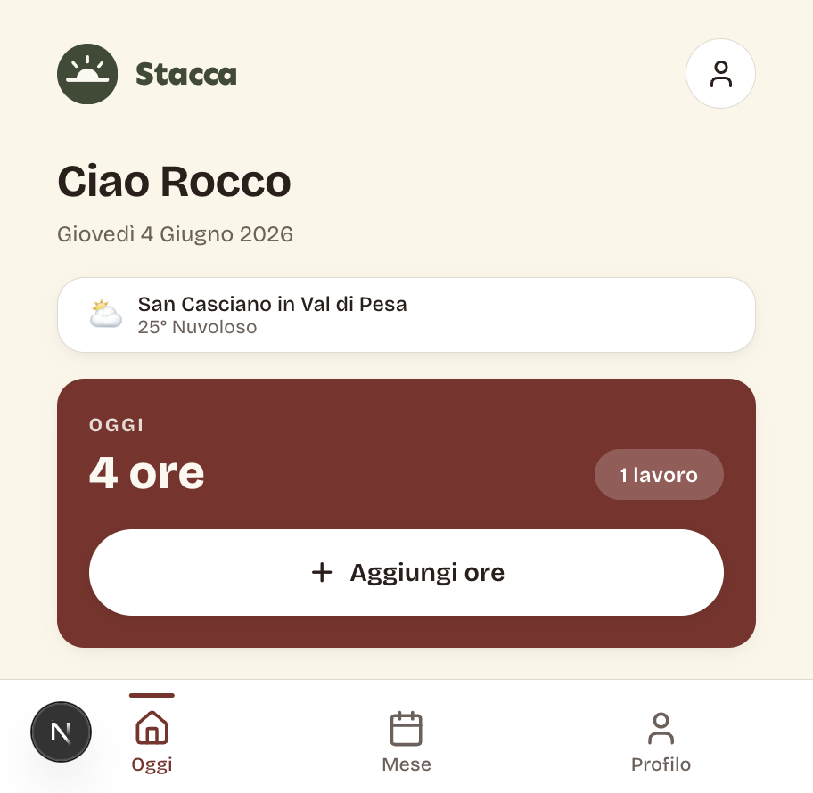
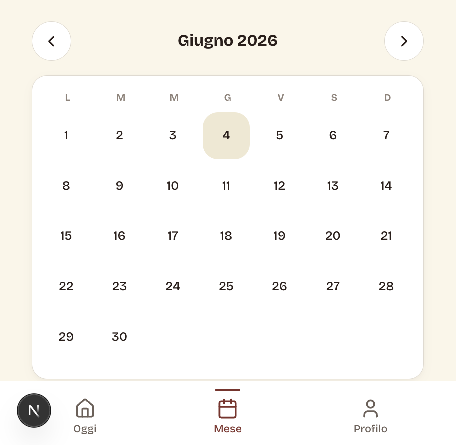
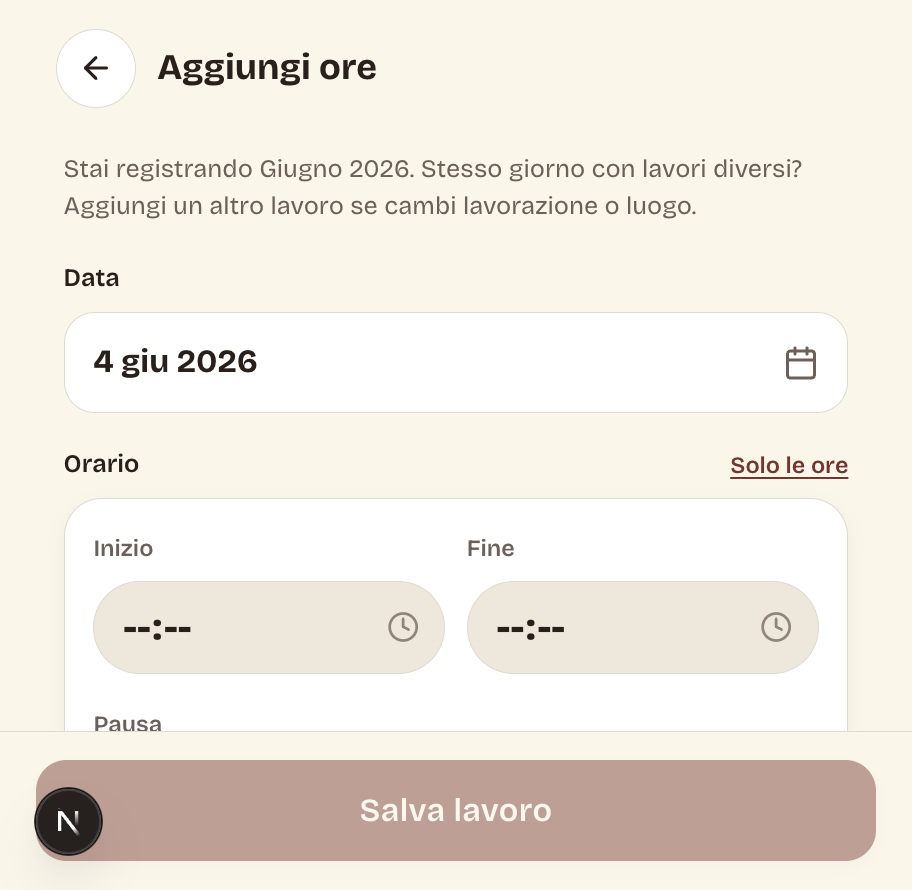
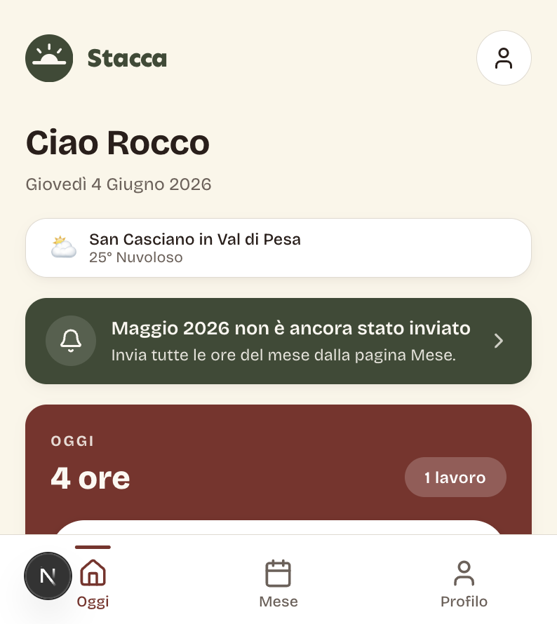

<p align="center">
  
</p>

<h1 align="center">Stacca</h1>

<p align="center">
  <strong>Mobile-first hours logging for vineyard and cellar crews</strong><br/>
  Built for <a href="https://www.corzanoepaterno.com/">Corzano e Paterno</a> · Tuscany, Italy
</p>

<p align="center">
  <em>Stacca</em> means <em>clock off</em> — end of shift, close the day, send the month.
</p>

<p align="center">
  <a href="https://github.com/roccogold/stacca-app">GitHub</a> ·
  <a href="web/README.md">Developer setup</a> ·
  Italian UI
</p>

---

## Why Stacca exists

Field workers should not fight a spreadsheet on a phone. Stacca is a **simple production diary**: log what you did, where, and for how long — then **submit the month once** when payroll needs a clean close. No jargon, no admin dashboard for crews, no duplicate submissions.

| For workers | For the winery |
|-------------|----------------|
| Big tap targets, Italian copy | One row per job in Google Sheets |
| Today view + fast entry form | Month lock after submit |
| Calendar month + stats by task & site | Pivot-ready numeric hours column |
| Swipe to delete, gentle reminders | Feedback email to admin |

---

## Screenshots

<p align="center">
  
  &nbsp;&nbsp;
  
  &nbsp;&nbsp;
  
</p>

<p align="center">
  
</p>

<p align="center"><sub>Home · Month calendar · Log a job · End-of-month reminder</sub></p>

---

## Core flow

```
Login → Today → Log / edit jobs → Month view → Submit month → Locked
```

1. **Today** — greeting, optional weather, hours logged today, list of jobs (swipe to delete while month is open).
2. **Add hours** — date, start/end (or hours-only), task (*lavorazione*), vineyard/site (*luogo*), optional note.
3. **Month** — calendar with dots on worked days, totals, breakdown by task and place, **Invia mese** with confirmation.
4. **After submit** — that month is read-only; a celebration confirms hours sent; Sheets gets a month-close row.

**Month reminder (home)** — olive banner when a month still has logged hours but has not been submitted: previous month anytime; current month on the **last calendar day** (Europe/Rome). Copy: *Ricordati di inviare il mese di giugno 2026*.

---

## Design

Warm Tuscan palette — cream background, wine-red accents, olive green for reminders. **Setting sun** mark (horizon + rays), not a clock face. Typography and spacing tuned for **gloved hands and bright sun**: 16px+ body, rounded 16px cards, bottom nav (Today · Month · Profile).

Brand assets live in [`web/public/stacca/`](web/public/stacca/).

---

## Tech stack

| Layer | Choice |
|-------|--------|
| App | [Next.js](https://nextjs.org) 16 (App Router), React 19 |
| Data | [Prisma](https://www.prisma.io) + PostgreSQL ([Supabase](https://supabase.com)) |
| Auth | Email + password, [iron-session](https://github.com/vvo/iron-session), bcrypt |
| Email | [Resend](https://resend.com) — password reset & in-app feedback |
| Payroll export | [Google Sheets API](https://developers.google.com/sheets/api) — per-entry sync + month close |
| Deploy | [Vercel](https://vercel.com) |

Time zones and month boundaries use **Europe/Rome**.

---

## Repository layout

| Path | Purpose |
|------|---------|
| **`web/`** | Production app — **deploy this** (`Root Directory` on Vercel) |
| **`docs/`** | README images & logo |
| **`mockups/`** | Early static HTML prototypes |
| **`lovable/`** | Lovable design export (reference only; sync, do not hand-edit) |

---

## Quick start

```bash
cd web
cp .env.example .env
npm install
npx prisma migrate deploy
npm run db:seed
npm run dev
```

Open [http://localhost:3000/login](http://localhost:3000/login).

Full environment variables, Google Sheets setup, Supabase, and Vercel deploy: **[web/README.md](web/README.md)**.

---

## License & context

Private project for Corzano e Paterno operations. UI copy is **Italian** by design — the audience is field and cellar staff, not HR software power users.

<p align="center">
  
</p>
